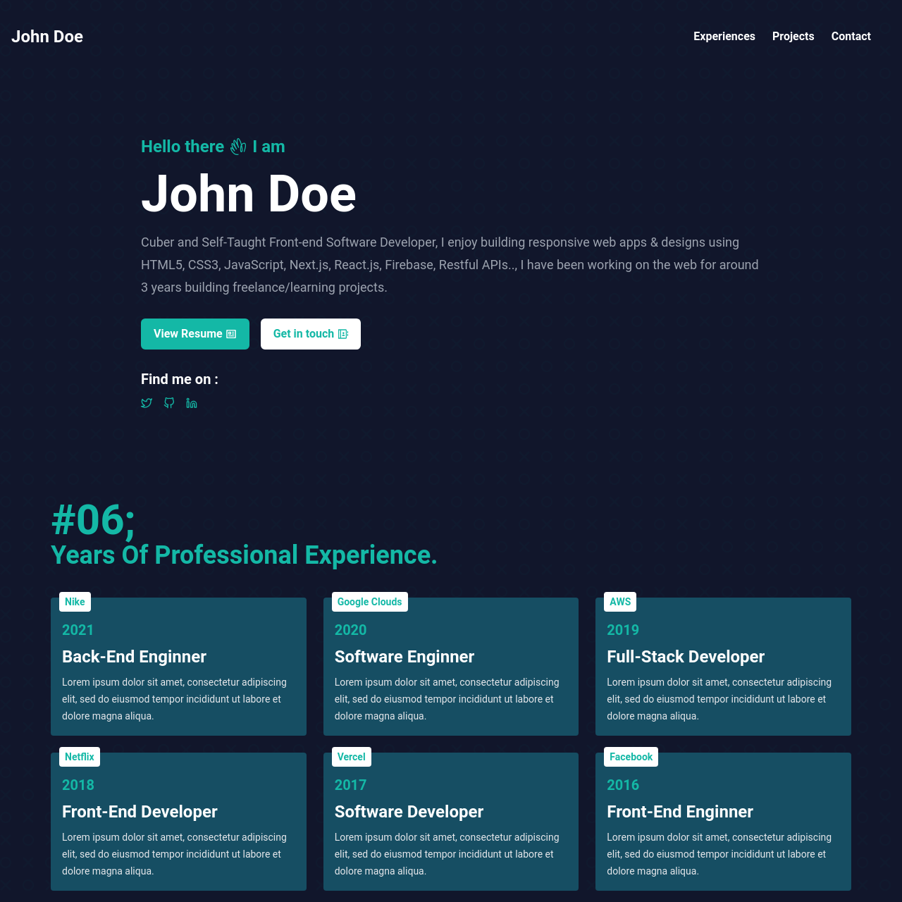

# Software Developer Portfolio :100:
A responsive and open source portfolio for software developers (Next.js & Tailwind CSS version).

<!-- ALL-CONTRIBUTORS-BADGE:START - Do not remove or modify this section -->

[](#contributors-)

<!-- ALL-CONTRIBUTORS-BADGE:END -->

## Website Screenshot


## Install Dependencies:
First install the needed dependencies:
```bash
npm install
```

## Getting Started
Run the development server:

```bash
npm run dev
# or
yarn dev
```

Open http://localhost:3000 with your browser to see the result.

[API routes](https://nextjs.org/docs/api-routes/introduction) can be accessed on [http://localhost:3000/api/hello](http://localhost:3000/api/hello). This endpoint can be edited in `pages/api/hello.js`.

The `pages/api` directory is mapped to `/api/*`. Files in this directory are treated as [API routes](https://nextjs.org/docs/api-routes/introduction) instead of React pages.

## Learn More

To learn more about Next.js, take a look at the following resources:

- [Next.js Documentation](https://nextjs.org/docs) - learn about Next.js features and API.
- [Learn Next.js](https://nextjs.org/learn) - an interactive Next.js tutorial.

You can check out [the Next.js GitHub repository](https://github.com/vercel/next.js/) - your feedback and contributions are welcome!

## Deploy on Vercel

The easiest way to deploy your Next.js app is to use the [Vercel Platform](https://vercel.com/new?utm_medium=default-template&filter=next.js&utm_source=create-next-app&utm_campaign=create-next-app-readme) from the creators of Next.js.

Check out our [Next.js deployment documentation](https://nextjs.org/docs/deployment) for more details.

&copy; 2022 - Made With ❤️ By <a href="https://ismailium.vercel.app/"><b>Ismailium</b></a>, using <a href="https://nextjs.org/"><b>Next.js</b></a> and <a href="https://tailwindcss.com/"><b>Tailwind CSS</b></a>, Deployed on <a href="https://vercel.com/"><b>Vercel</b></a>.
